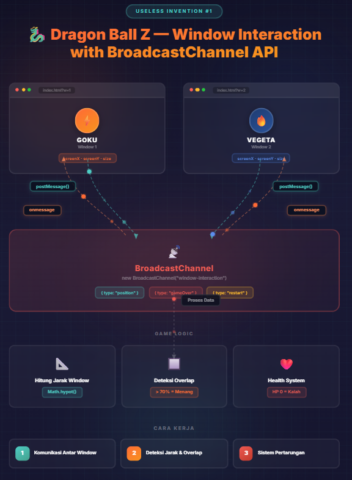

# 🐉 Dragon Ball Z — Window Interaction with BroadcastChannel API

> **Useless Invention #1** — A window battle game where two browser windows fight each other using only native Web APIs.

## Demo

- [Goku (Window 1)](https://iwanni.github.io/useless-inventions-window-interaction?w=1) — `?w=1`
- [Vegeta (Window 2)](https://iwanni.github.io/useless-inventions-window-interaction?w=2) — `?w=2`

## What Is This?

Two browser windows containing Goku and Vegeta battle each other based on their real-world position on your screen. Move the windows around — when they get close or overlap, the fight begins!

## Features

- **Cross-Window Communication** — Uses BroadcastChannel API to send and receive position & size data between windows every 100ms, with no server required
- **Distance-Based Interaction** — Characters power up and fire attacks when windows are within 510px of each other
- **Overlap Detection** — Calculates the intersection area between two windows; 70%+ overlap triggers a win condition
- **Health System** — Each character has 100 HP. Proximity deals 8.5 damage/tick; significant overlap deals 15 damage/tick
- **Dynamic Rotation** — Characters rotate to always face each other based on real screen positions
- **Game Over & Restart** — Win/lose state is synchronized across both windows instantly
- **Immersive Audio** — Different DBZ sound effects for idle charging and attack firing

## How to Play

1. Open `index.html` in your browser
2. Open the same file in a **second browser window** (not a tab)
3. Add `?w=2` to the second window's URL to play as Vegeta
4. **Move the windows around your screen** — the closer they are, the more damage they deal
5. **Overlap one window on top of the other** (70%+ coverage) to instantly defeat your opponent
6. Click or tap either window once to unlock audio

## URL Parameters

| Parameter | Character | Description |
|---|---|---|
| `?w=1` | Goku | Faces right by default |
| `?w=2` | Vegeta | Mirrored (faces left) |

## Architecture

The game uses **BroadcastChannel API** as the backbone for all cross-window communication:

1. **Send** — Each window broadcasts its `screenX`, `screenY`, `outerWidth`, and `outerHeight` every 100ms
2. **Receive** — The other window listens and uses that data to calculate distance, rotation, and overlap
3. **Game Events** — `{ type: "gameOver" }` and `{ type: "restart" }` messages are broadcast to sync game state across both windows

### Message Types

| Type | Payload | Purpose |
|---|---|---|
| `position` | `x, y, w, h, id, creationTime` | Broadcast window position & size |
| `gameOver` | `id, winner` | Notify the other window of defeat |
| `restart` | `id` | Trigger a synchronized game restart |

## Technical Details

| Parameter | Value |
|---|---|
| Update Frequency | 100ms (`setInterval`) |
| Distance Threshold | 510px between window centers |
| Overlap Win Condition | ≥ 70% of opponent window covered |
| Proximity Damage | 8.5 HP per tick |
| Overlap Damage | 15 HP per tick |
| Damage Cooldown | 300ms |
| Max Health | 100 HP |
| Tiebreaker | Oldest window (by creation time) wins |

## Assets

| File | Used For |
|---|---|
| `assets/goku-dbz.gif` | Goku idle animation |
| `assets/dragonball-z-vegeta.gif` | Vegeta idle animation |
| `assets/kamehameha.gif` | Attack animation (both characters) |
| `assets/super-saiyan-2.mp3` | Background charge audio (idle) |
| `assets/basicbeam_fire2.mp3` | Attack fire sound (one-shot) |
| `assets/beamhead.mp3` | Beam sustain audio (loop after fire) |

## Credits

- **Sound Effects**: [MyInstants](https://www.myinstants.com/)
- **GIF Images**:
  - [Super Saiyan Goku](https://tenor.com/view/super-saiyan-goku-dbz-charging-gif-17464307) — Tenor
  - [Goku Kamehameha](https://tenor.com/view/goku-dragonball-gif-8466428) — Tenor
  - [Vegeta](https://tenor.com/view/vegeta-gif-1615384944259328642) — Tenor
  - [Vegeta Kamehameha](https://gifs.alphacoders.com/gifs/view/35158) — Alpha Coders
